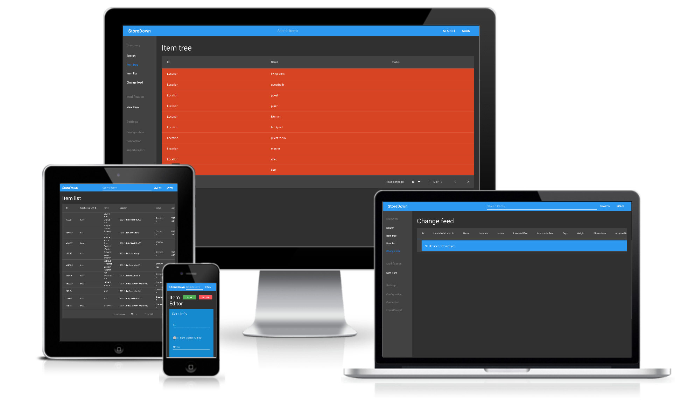

# StoreDown

> Do not store up for yourselves treasures on earth, where moths and vermin destroy, and where thieves break in and steal.

I live by the mantra

> If you cannot find something or cannot put it away, you don't need it.

StoreDown is a Progressive Web App(PWA) designed to help you put stuff away and find it again.
Due to the way StoreDown was built it can also be a forms application fronting CouchDB.(Like a very simple alternative of Microsoft Access)

I personally use StoreDown every day to keep track of 1,359 items  at time of writing. Those items range from: a 90 pack of dental floss picks, a Jig saw, a refrigerator, to red 15W USB A to USB C cable(of which I have 6). If having this capability appeals to you, come along and enjoy the fun!

## [Demo/Application](https://storedown.org/dist/)
Click `RUN IN LOCAL MODE` in the bottom left to quickly demo/test.
[Here is some test data you can import](https://gist.github.com/FoxUSA/80bc1b72b896a5d1db550ea7aaf4a167)

> If you use this you should probably take regular backups exports of your data.

> If you want to sync between multiple devices, you need to setup a [CouchDB server](https://hub.docker.com/_/couchdb).

## Features
- BYOS(Bring Your Own Server)
- Touch friendly and mouse friendly ui
- Search
- Can function offline
- CouchDB Sync via PouchDB
- Responsive
- Tags
- Customizable fields
- Data Export(JSON, YML, and CSV)
- Data Import(JSON, and YML)
- TODO markdown

## Quick Links
- [How to install](./docs/install.md)
- [How to develop](./docs/development.md)
- [Config/Custom field customization](./docs/config.schema.md)
- [How I use StoreDown](./docs/system.md)
- [Sub Reddit](https://www.reddit.com/r/storedown/)

